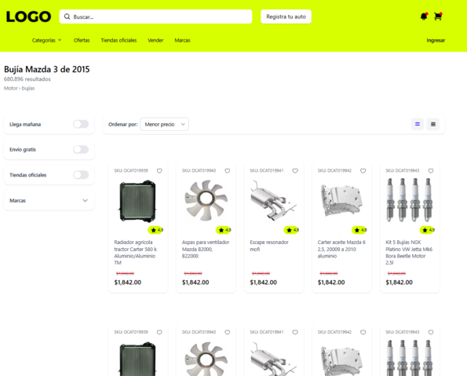
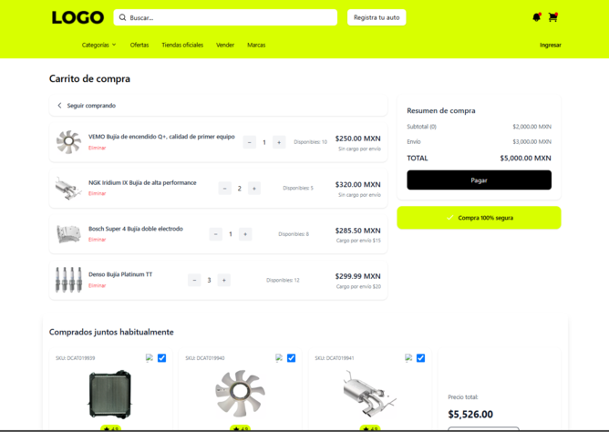
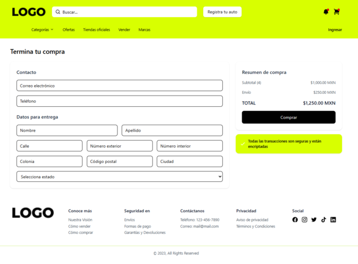
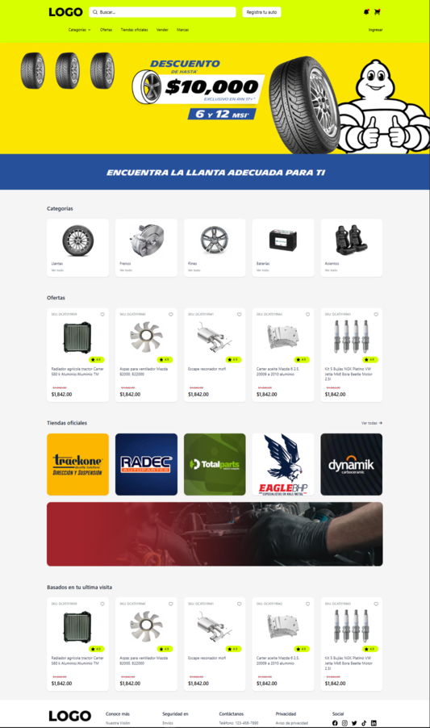
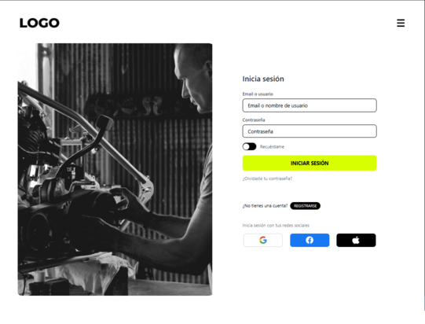
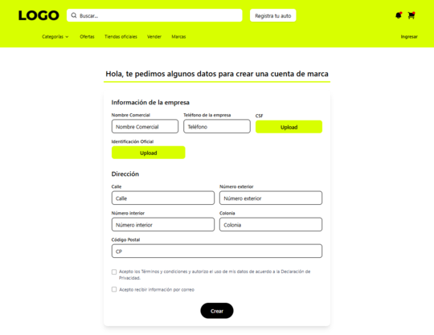

# MB Technical Test

Este repositorio contiene una aplicación frontend desarrollada en Angular sin Zone.js (zoneless) como parte de una prueba técnica.

## 📁 Estructura del Proyecto

```plaintext
mb-technical-test/
├── angular.json
├── package.json
├── tsconfig.json
├── tsconfig.app.json
├── tsconfig.spec.json
├── public/
│   ├── favicon.ico
│   └── assets/
├── src/
│   ├── index.html
│   ├── main.ts
│   ├── styles.scss
│   ├── app/
│   │   ├── app.component.ts
│   │   ├── app.component.html
│   │   ├── app.component.scss
│   │   ├── app.routes.ts
│   │   ├── app.config.ts
│   │   ├── core/
│   │   │   ├── auth/
│   │   │   │   ├── auth.component.ts
│   │   │   │   ├── auth.routes.ts
│   │   │   │   ├── components/
│   │   │   │   │   ├── login/
│   │   │   │   │   ├── new-password/
│   │   │   │   │   └── register/
│   │   │   │   ├── interfaces/
│   │   │   │   │   └── external/
│   │   │   │   └── services/
│   │   │   │       └── external-auth.service.ts
│   │   │   ├── configs/
│   │   │   │   ├── ngx-ui-loader.config.ts
│   │   │   │   └── toastr.config.ts
│   │   │   ├── guards/
│   │   │   │   └── auth-external.guard.ts
│   │   │   ├── interceptors/
│   │   │   │   ├── auth-external.interceptor.spec.ts
│   │   │   │   └── auth-external.interceptor.ts
│   │   │   └── models/
│   │   │       └── auth.model.ts
│   │   ├── presentation/
│   │   │   └── dashboard/
│   │   │       ├── dashboard.component.css
│   │   │       ├── dashboard.component.html
│   │   │       └── dashboard.component.ts
│   │   └── shared/
│   │       ├── components/
│   │       │   ├── bought-together/
│   │       │   ├── carrito-compras/
│   │       │   ├── categories-horizontal-list/
│   │       │   ├── checkout-page/
│   │       │   ├── footer/
│   │       │   ├── header/
│   │       │   ├── products-horizontal-list/
│   │       │   ├── products-page/
│   │       │   ├── store-card/
│   │       │   ├── stores-horizontal-list/
│   │       │   └── summary-card/
│   └── environments/
│       ├── environment.development.ts
│       └── environment.ts
```

## 🚀 Instalación

1. Clonar el repositorio:
   ```bash
   git clone https://github.com/usuario/mb-technical-test.git
   cd mb-technical-test
   ```
2. Instalar dependencias:
   ```bash
   npm install
   ```

## 🔧 Ejecución

- Levantar servidor de desarrollo:
  ```bash
  npm start
  ```
- Ejecutar tests:
  ```bash
  npm test
  ```

## ⚙️ Configuración Zoneless

La aplicación está configurada para funcionar sin Zone.js:

- Se eliminó la dependencia de `zone.js` en el `polyfills.ts`.
- Se usan APIs de bootstrap de Angular independiente de zonas:
  ```ts
  import { bootstrapApplication } from '@angular/platform-browser';
  import { AppComponent } from './app/app.component';

  bootstrapApplication(AppComponent, {
    providers: [
      // Proveedores necesarios...
    ]
  });
  ```

- Las rutas y servicios están definidos usando `provideRouter` y `provideHttpClient` para evitar la zona.

## 🖼️ Screenshots

A continuación, se presentan algunas capturas de pantalla de la aplicación:

- **Pantalla de Búsqueda:**
  

- **Carrito de Compras:**
  

- **Página de Checkout:**
  

- **Dashboard:**
  

- **Pantalla de Login:**
  

- **Pantalla de Registro:**
  

## 📄 Licencia

Este proyecto es una prueba técnica y no tiene licencia de uso.
